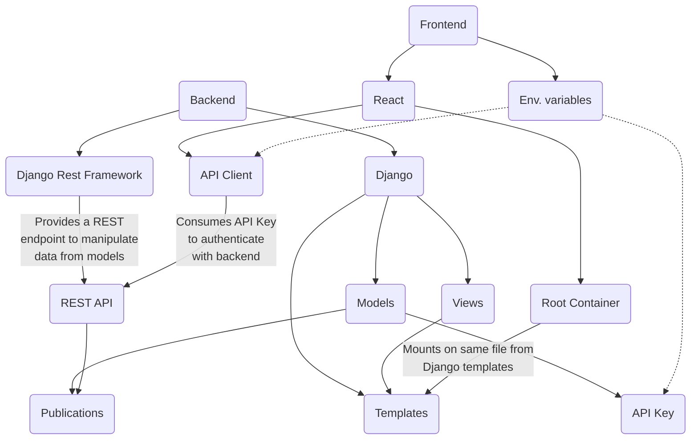
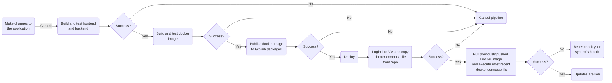
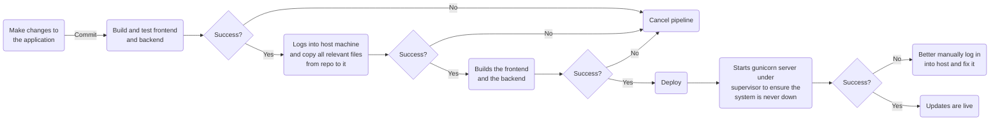
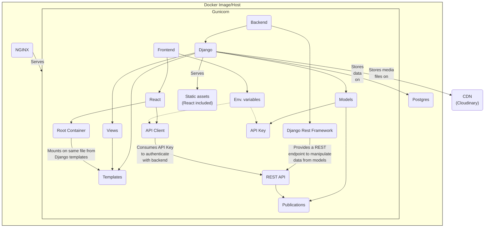

# django-react-typescript <!-- omit from toc -->


This is an non-opinionated Django 5 + React 18 boilerplate built with great development experience and easy deployment in mind.

This template is ideal if you want to bootstrap a blog or a portfolio website quickly, or even a more complex application that requires a CMS, all while leveraging the best from React and Django.

---

- [Getting started](#getting-started)
  - [Setting up a database](#setting-up-a-database)
  - [Setting up a CDN](#setting-up-a-cdn)
  - [Running the project](#running-the-project)
- [Application architecture](#application-architecture)
  - [Features](#features)
- [Going to production: infrastructure \& deployment](#going-to-production-infrastructure--deployment)
  - [Virtualized Deploy Workflow](#virtualized-deploy-workflow)
  - [Bare-metal Deploy Workflow](#bare-metal-deploy-workflow)
  - [Configuration](#configuration)
  - [Architecture overview](#architecture-overview)
- [Similar projects](#similar-projects)

## Getting started

This project relies on [pnpm](https://pnpm.io/) and [Poetry](https://python-poetry.org/) to manage Node.js and Python dependencies, respectively. Make sure to have both installed on your machine before proceeding.

After cloning this project, install all dependencies by running:

```sh
pnpm run bootstrap
```

This command will install all dependencies for the frontend (React) and backend (Django) apps.

### Setting up a database

To start developing on this project, you will need a Postgres database instance running. It doesn 't matter if it's a local instance or a remote one. Just make sure to set up a Postgres database and configure the `.env` file with the correct credentials.

For convenience, if you want to use Docker + Docker Compose to spin up a Postgres instance locally, with pgAdmin using alongisde, use the following command:

```sh
pnpm run dev:db:up
```

### Setting up a CDN

This project uses Cloudinary as a CDN, so you will need to have an account on Cloudinary and set up the `.env` file with the correct credentials. Use the [`.env.example`](./.env.example) file as a reference.

Feel free to open an issue if you want to use another CDN, and I'll be happy to help you set it up.

### Running the project

Once you've set up the database, you can start the project by running one of:

```sh
pnpm dev # Starts the project while assuming you've setup a database not using the Docker Compose setup. Spins up only the backend and frontend apps
pnpm dev:full # Starts the project while assuming you've setup a database using the Docker Compose setup. Spins up a Postgres instance and pgAdmin alongside the backend and frontend apps
```

By default, the frontend app will run on `localhost:4000` and the backend app will run on `localhost:8000`. If you're running the containerized Postgres, it will run on `localhost:5432` and pgAdmin will run on `localhost:5050`.

It's important to note that **for the best development experience, you should run the backend and frontend apps separately**. This way, you can take advantage of the hot-reload feature from Webpack and Django's development server.

Although you can replicate the aforementioned behavior on a production environment (run the backend and frontend apps on differen servers), **this project is built to run both apps on the same server in production, with the frontend app being served by Django's template engine and view functions**. You can learn more about how everything is tied up together below 👇

## Application architecture

This application's architect is quite simple and leverages the best of both Django and React. On a nutshell, React and Django integrate through Django's view functions and Django Rest Framework's API endpoints. There is no secret sauce here, just a simple and straightforward integration.



### Features

Below you will find the stack used for each part of the application and the features that are already implemented.

| Stack      | Libraries and services                                            | Features                         |
| ---------- | ----------------------------------------------------------------- | -------------------------------- |
| Frontend   | React 18, React Router 6, Typescript 5, Webpack 5, Tailwind CSS 3 | Publication listing and search   |
| Backend    | Django 5, Django Rest Framework                                   | Publication CRUD, API Key CRUD   |
| Database   | Postgres                                                          | -                                |
| CDN        | Cloudinary                                                        | -                                |
| CI/CD      | GitHub Actions                                                    | Multiple deploy workflow options |
| Monitoring | Sentry                                                            | -                                |

## Going to production: infrastructure & deployment

Although this project provides some guidelines on how to deploy the app, it is not mandatory to follow them. You can deploy the app on any platform you want, as long as it supports Docker and Docker Compose, or even deploy the app on a bare-metal machine. **By the end of the day, you should use the provided GitHub Actions workflows as a reference to build your own deployment pipeline and meet your requirements**.

Nonetheless, this codebase has two deploy methods available via GitHub actions:

### Virtualized Deploy Workflow

The `vm-deploy` branch will trigger this wokflow. You can use it to deploy the app to any Virtual Machine accessible via SSH (AWS EC2s, GCloud apps, Digital Ocean droplets, Hostgator VPSs, etc), and you would likely want to change the name of these branches to something more meaningful to your project.

This is what the workflow does:



### Bare-metal Deploy Workflow

The `bare-metal-deploy` branches will trigger this workflow. You can use it to deploy the app straight on the host machine, without any virtualization. This is not recommended, but ou never know when you will need to deploy an app on a bare-metal machine 🤷‍♀️. This pipeline assumes that you've got Node.js, Python, [Gunicorn](https://gunicorn.org/) and [Supervisord](http://supervisord.org/) installed on the host machine.

This is what the workflow does:



### Configuration

You must be familiar with the expected environment variables to run the project. Here is a list of the environment variables you must set alongside the ones you already know ([`.env.example`](./.env.example) from root, [`.env.example`](./frontend/.env.example) from frontend) production environments and must be set as secrets on your GitHub repository and made available to GitHub Actions.

| Environment variable | Description                                                                           |
| -------------------- | ------------------------------------------------------------------------------------- |
| IMAGE_NAME           | Docker image name                                                                     |
| MODE                 | `production`. This is hardcoded on the [Dockerfile](./Dockerfile)                     |
| ALLOWED_HOSTS        | A set of hosts allowed to pass CORS policy. I.g: "www.example.com" "example.com"      |
| DEPLOY_TOKEN         | A Github token with permission to pull this project's image from your Github registry |
| HOST                 | The domain under which your site will be hosted (i.g.:example.com)                    |
| SSH_PRIVATE_KEY      | The SSH key used to access the host machine                                           |
| USERNAME             | The SSH username used to access the host machine                                      |  |

### Architecture overview

Building up on the [application architecture diagram](#application-architecture), here is a more detailed overview of how the application is structured on a production environment:



## Similar projects

React and Django are a great combination, and there are many projects out there that leverage the best of both worlds. Make sure to check them out if you're looking for a more opinionated boilerplate/different approach:

- [django-react-boilerplate](https://github.com/vintasoftware/django-react-boilerplate)
