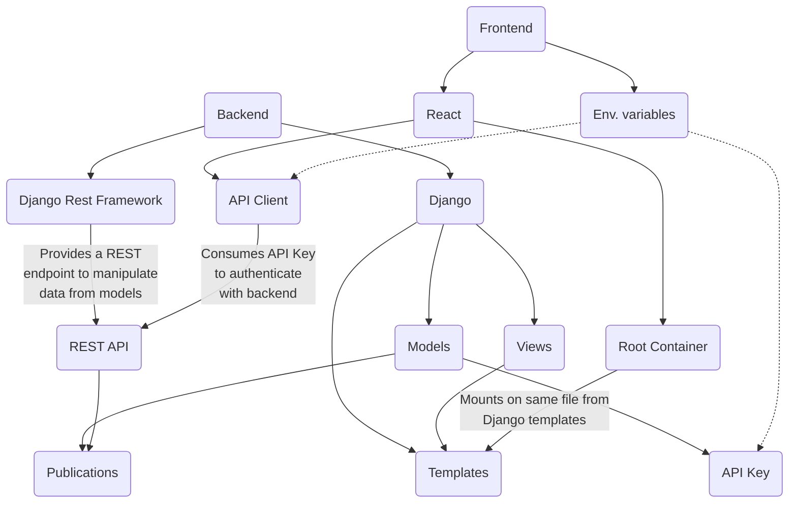

[](LICENSE)


<p align="center">
  
  <p align="center">Fully-featured, Django v5 + React v18 boilerplate with great DX.</p>
</p>

---

This is a fully-featured Django + React boilerplate built for great development experience and easy deployment guidelines.

## Getting started

After cloning this project, install all dependencies by running:

```sh
pnpm run bootstrap
```

This command will install all dependencies for the frontend (React) and backend (Django) apps.

### Setting up a database

To start developing on this project, you will need a Postgres database instance running. It doesn 't matter if it's a local instance or a remote one. Just make sure to set up a Postgres database and configure the `.env` file with the correct credentials.

For convenience, if you want to use Docker + Docker Compose to spin up a Postgres instance locally, with pgAdmin using alongisde, use the following command:

```sh
pnpm run dev:db:up
```

### Running the project

Once you've set up the database, you can start the project by running one of:

```sh
pnpm dev # Starts the project while assuming you've setup a database not using the Docker Compose setup. Spins up only the backend and frontend apps
pnpm dev:full # Starts the project while assuming you've setup a database using the Docker Compose setup. Spins up a Postgres instance and pgAdmin alongside the backend and frontend apps
```

By default, the frontend app will run on `localhost:4000` and the backend app will run on `localhost:8000`. If you're running the containerized Postgres, it will run on `localhost:5432` and pgAdmin will run on `localhost:5050`.

## Application architecture

This application's architect is quite simple and leverages the best of both Django and React. On a nutshell, React and Django integrate through Django's Views and Django Rest Framework's API endpoints.



### Global

- Commit lint rules

### Frontend

- [React](https://reactjs.org/)
- [Typescript](https://www.typescriptlang.org/)
- [React Router](https://reactrouter.com/)
- [Webpack](https://webpack.js.org/)

| Other features              | Status      |
| --------------------------- | ----------- |
| SSR ready                   | In progress |
| Service workers             | ✔️           |
| Gzip static file gen        | ✔️           |
| Cache control               | ✔️           |
| Code split and lazy loading | ✔️           |
| Google Analytics ready      | ✔️           |
| PWA ready                   | ✔️           |

### Backend

- [Django](https://www.djangoproject.com/)
- [Django REST Framework](https://www.django-rest-framework.org/)
- Django CORS Headers

| Other features       | Status |
| -------------------- | ------ |
| Token authentication | ✔️      |
| SMTP ready           | ✔️      |

### Infrastructure

- Docker image featuring
  - [Memcached](https://memcached.org/)
  - [PostgreSQL](https://www.postgresql.org/)
- [Supervisor](http://supervisord.org/) (optional, should be used if you're deploying on a non-virtualized system)

| Other features                                                                                                                                                                                            | Status |
| --------------------------------------------------------------------------------------------------------------------------------------------------------------------------------------------------------- | ------ |
| NGINX config file                                                                                                                                                                                         | ✔️      |
| CI/CD to any V.M. (AWS EC2s, GCloud apps, Digital Ocean droplets, Hostgator VPSs, etc) accessible via SSH (the `hml` and `prd` branches will trigger the [deploy workflow](#Virtualized-Deploy-Workflow)) | ✔️      |
| CI/CD to deploy straight on host (without virtualization; not recommended) (the branch `prd-host` will trigger this. See more on the [host deploy workflow](#Host-Deploy-Workflow) method)                | ✔️      |

### Integrations

- [Sentry](https://sentry.io/welcome/)
- [Cloudinary](https://cloudinary.com/)
- [Twilio](https://www.twilio.com/)
- [Google Analytics](https://analytics.google.com/analytics/web/)

## Development directions

1. Clone this repo: `git clone https://github.com/marcelovicentegc/django-react-typescript.git`
2. Create a virtual environment: `python -m venv venv`
3. Activate it ☝️: `source venv/bin/activate` or `venv\Scripts\activate` if you're on a Windows
4. Install dependencies: `npm i && pip install -r requirements.txt && cd frontend && npm i`
5. Setup the project `.env` file by taking as example the `.env.example` on the root folder (refer to [configuration](#Configuration) for more details)
6. Setup the frontend app's `frontend/.env` file by taking as example the `frontend/.env.example` file (refer to [configuration](#Configuration) for more details)
7. Start the application: `npm start` (make sure Postgres is up and running)

## Configuration

You should configure these variables on a `.env` file on the root folder for the global configuration and a `.env` file for the frontend configuration under `frontend/.env` when developing. As for deploying the app, **you will need to set the same set of dev variables + some variables exclusively used in production environments as [_secrets_](https://docs.github.com/en/actions/configuring-and-managing-workflows/creating-and-storing-encrypted-secrets)**.

### Global

| Environment variable | Default                                              | Description                                                                                                                                                                                 |
| -------------------- | ---------------------------------------------------- | ------------------------------------------------------------------------------------------------------------------------------------------------------------------------------------------- |
| SECRET_KEY           | w%h-ok)&7l2e@1&ht!#ol3!!qg9zwz9hs\$wf@fk4e0-7x1r\*#d | Django's SECRET_KEY used to encrypt passwords. It can be generated by running: `python -c 'from django.core.management.utils import get_random_secret_key; print(get_random_secret_key())'` |
| CDN_NAME             | -                                                    | Cloudinary's CDN name                                                                                                                                                                       |
| CDN_API_KEY          | -                                                    | Cloudinary's CDN API key                                                                                                                                                                    |
| CDN_API_SECRET       | -                                                    | Cloudinary's CDN API secret                                                                                                                                                                 |
| DB_HOST              | -                                                    | Database host name                                                                                                                                                                          |
| DB_NAME              | -                                                    | Database name                                                                                                                                                                               |
| DB_USER              | -                                                    | Database user                                                                                                                                                                               |
| DB_PASSWORD          | -                                                    | Database password                                                                                                                                                                           |
| DB_PORT              | -                                                    | Databse port                                                                                                                                                                                |
| SMTP_HOST_USER       |                                                      | Your SMTP email (should be a GMail one)                                                                                                                                                     |
| SMTP_HOST_PASSWORD   | -                                                    | Your SMTP email password                                                                                                                                                                    |
| TEST                 | 0                                                    | Used to test the app on the pipeline                                                                                                                                                        |
| TWILIO_ACCOUNT_SID   | -                                                    | Your Twilio account SID (**optional**)                                                                                                                                                      |
| TWILIO_AUTH_TOKEN    | -                                                    | Your Twilio account Auth token(**optional**)                                                                                                                                                |
| TWILIO_WPP_NUMBER    | -                                                    | Your Twilio account's Whatsapp number (**optional**)                                                                                                                                        |

#### Exclusively used in production

| Environment variable | Must be                                                                                              |
| -------------------- | ---------------------------------------------------------------------------------------------------- |
| IMAGE_NAME           | Docker image name (for HML, it will append `-hml` on its name)                                       |
| MODE                 | `production`. This is hardcoded on the [Dockerfile](./Dockerfile)                                    |
| ALLOWED_HOSTS        | A set of hosts allowed to pass CORS policy. I.g: "www.example.com" "example.com"                     |
| HML_ALLOWED_HOSTS    | Same as ALLOWED_HOSTS but for a HML environment                                                      |
| DEPLOY_TOKEN         | A Github token with permission to pull this project's image from your Github registry                |
| HML_DEPLOY_TOKEN     | Same as DEPLOY_TOKEN but for a HML environment                                                       |
| HOST                 | The domain under which your site will be hosted (i.g.:example.com)                                   |
| HML_HOST             | Same of HOST but for a HML environment (i.g.: hml.example.com)                                       |
| SSH_PRIVATE_KEY      | The SSH key used to access the host machine (currently, one for both PROD and HML environments)      |
| USERNAME             | The SSH username used to access the host machine (currently, one for both PROD and HML environments) |

### Frontend

| Environment variable | Default       | Description                                                                                                                                                                                                                                   |
| -------------------- | ------------- | --------------------------------------------------------------------------------------------------------------------------------------------------------------------------------------------------------------------------------------------- |
| NODE_ENV             | `development` | Let's Webpack know when to build files to correct public path, optimize code and when to prepend localhost for API endpoints or not. Values must be either `development` or `production`. This is hardcoded on the [Dockerfile](./Dockerfile) |
| AUTH_TOKEN           | -             | An auth key generated on Django's admin that must be associated to a user with specific permissions (i.g.: read specific infos from Django's ORM)                                                                                             |
| GTAG_ID              | -             | Google Analytics ID                                                                                                                                                                                                                           |

#### Exclusively used in production

| Environment variable | Must be                                    |
| -------------------- | ------------------------------------------ |
| HML_AUTH_KEY         | Same as AUTH_KEY but for a HML environment |
| HML_GTAG_ID          | Same as GTAG_ID but for a HML environment  |

## Deployment worfklows

### Virtualized Deploy Workflow

Branches `hml` and `prd` will trigger this workflow.


### Host Deploy Workflow

For this kind of deploy to work, you will need a running Postgres database, Nginx, and Supervisor processes.

## Basic architecture


