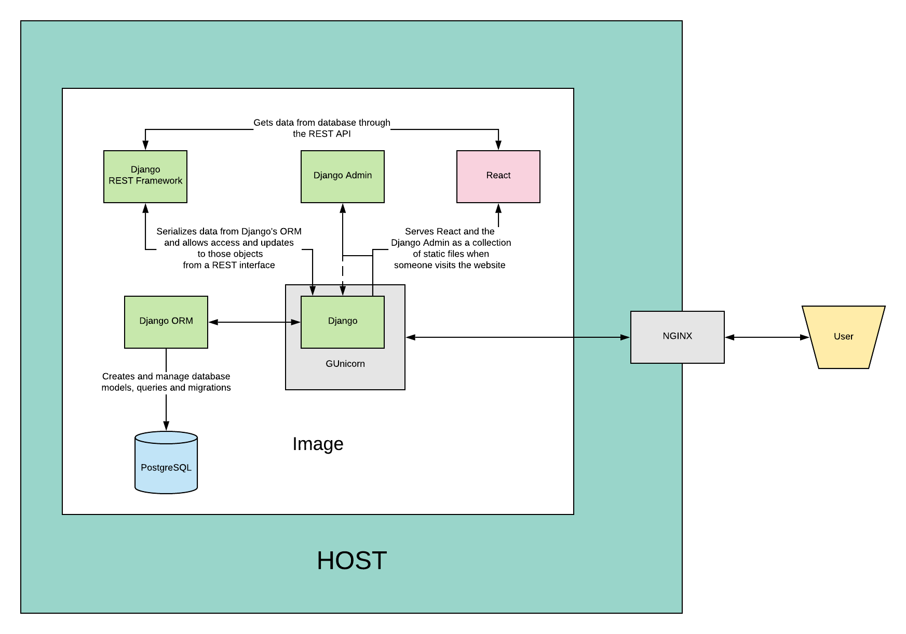

  
  
Your favorite React-Django boilerplate.

---

## Features

| Feature                     | Status |
| --------------------------- | ------ |
| SSR                         | ✔️     |
| Service workers             | ✔️     |
| Gzip static file            | ✔️     |
| Cache-control               | ✔️     |
| Uploaded images compression | ✔️     |
| CI/CD pipelines             | ✔️     |

- UI library:

  1. **React**

- State management:

  1. **React's Context API**

- Styling system:

  1. **Styed Components**

- Unit tests lib:

  1. **React Testing Library**

- CMS

  1. **Django**

- REST API

  1. **Django Rest Framework**

- Database

  1. **PostgreSQL**

- Cache backend

  1. **Memcached**

## Basic architecture

